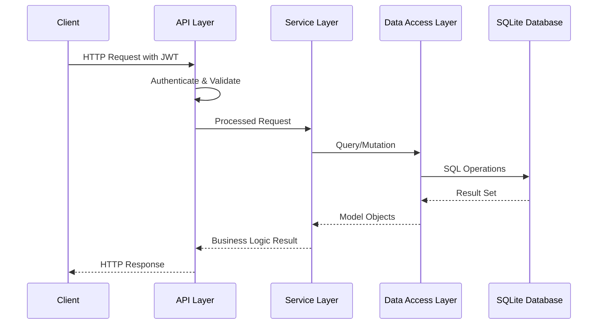
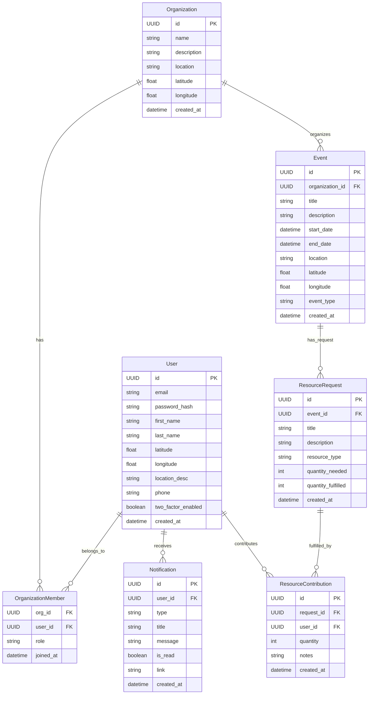
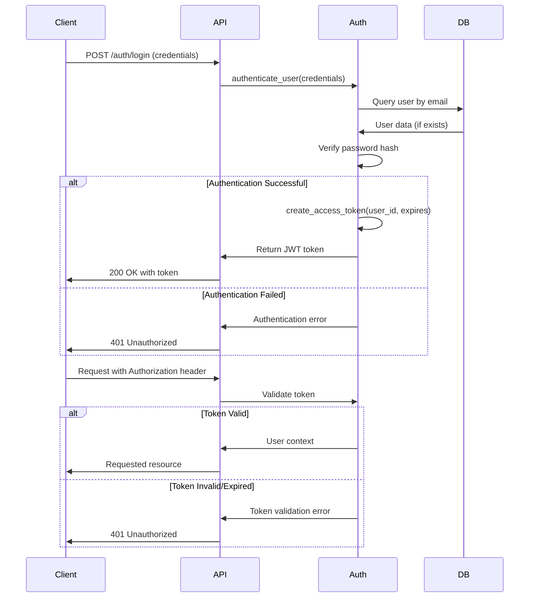
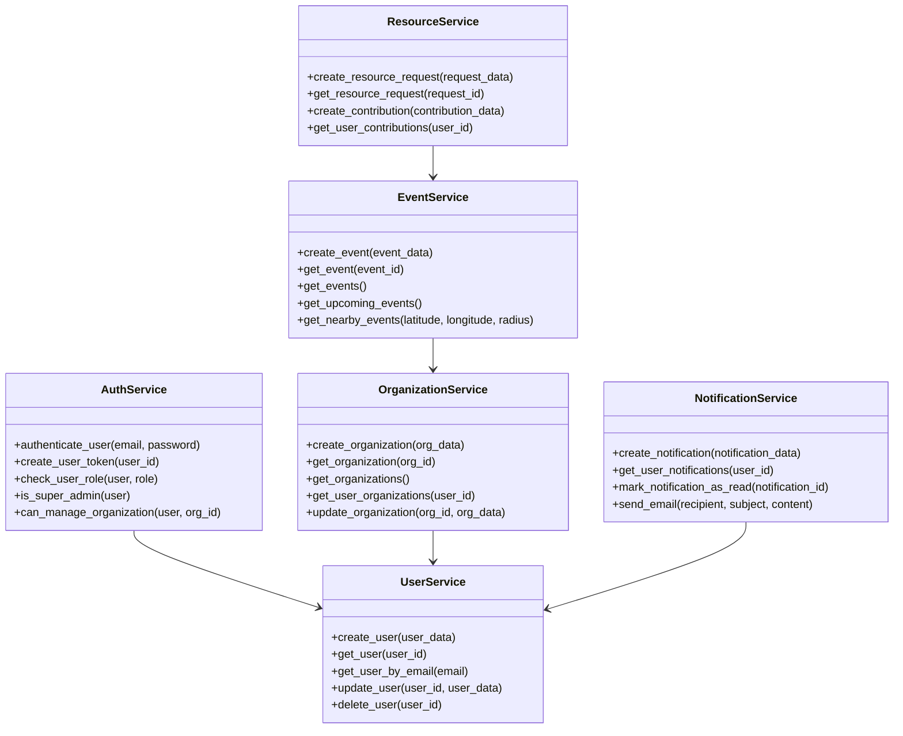
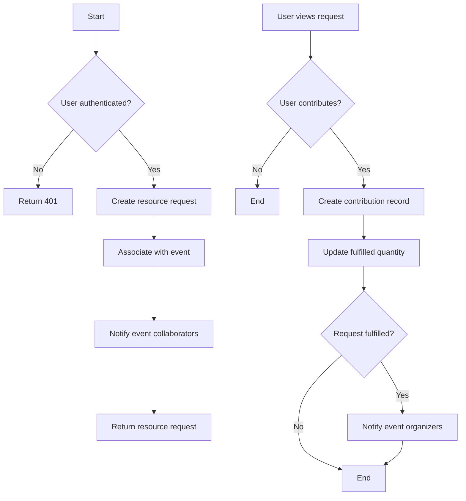

# Tweeza Backend Technical Documentation

## Overview

Tweeza is a donation and resource sharing platform designed to connect donors, organizations, and beneficiaries in Algeria. The platform facilitates donation tracking, volunteer coordination, and resource allocation to combat food waste and improve humanitarian aid distribution.

## System Architecture

### High-Level Architecture

The backend follows a layered architecture pattern with clean separation of concerns:

```
Client Layer → API Layer → Service Layer → Data Access Layer → Database Layer
```

Key components:

- **FastAPI Application**: High-performance API framework
- **SQLAlchemy ORM**: Object-relational mapping for database operations
- **SQLite Database**: Lightweight, portable database solution
- **JWT Authentication**: Secure token-based authentication
- **OAuth Integration**: Support for social login providers

### Component Interactions



## Core Features

### 1. User Management

- User registration and authentication
- Profile management
- Role-based access control (User, Organization Admin, Super Admin)
- Two-factor authentication
- OAuth integration (Google, Facebook)

### 2. Organization Management

- Organization registration and profile management
- Member management with roles (Admin, Member)
- Organization analytics and insights

### 3. Event Management

- Event creation and management
- Collaborator coordination
- Beneficiary tracking
- Location-based event discovery

### 4. Resource Management

- Resource request creation
- Contribution tracking
- Needs assessment
- Resource allocation optimization

### 5. Notification System

- Email notifications
- In-app notifications
- SMS integration (for critical updates)

## API Specification

### Authentication Endpoints

| Path                                   | Method | Description                      | Rate Limit |
| -------------------------------------- | ------ | -------------------------------- | ---------- |
| `/api/v1/auth/login`                 | POST   | User login with credentials      | 30/min     |
| `/api/v1/auth/register`              | POST   | Register a new user              | 10/min     |
| `/api/v1/auth/register-organization` | POST   | Register organization with admin | 5/min      |
| `/api/v1/auth/google-login`          | GET    | Initiate Google OAuth flow       | 10/min     |
| `/api/v1/auth/facebook-login`        | GET    | Initiate Facebook OAuth flow     | 10/min     |
| `/api/v1/auth/2fa/enable`            | POST   | Enable two-factor auth           | 5/min      |

### User Endpoints

| Path                        | Method | Auth Required | Description              | Role Required         |
| --------------------------- | ------ | ------------- | ------------------------ | --------------------- |
| `/api/v1/users/me`        | GET    | Yes           | Get current user profile | Any                   |
| `/api/v1/users/`          | GET    | Yes           | List all users           | Admin/SuperAdmin      |
| `/api/v1/users/search`    | GET    | Yes           | Search for users         | Any                   |
| `/api/v1/users/{user_id}` | GET    | Yes           | Get user by ID           | Any*                  |
| `/api/v1/users/{user_id}` | PUT    | Yes           | Update user              | Self/Admin/SuperAdmin |

*Users can view limited info of other users, full info for themselves

### Organization Endpoints

| Path                                       | Method | Auth Required | Description               | Role Required |
| ------------------------------------------ | ------ | ------------- | ------------------------- | ------------- |
| `/api/v1/organizations/`                 | GET    | No            | List organizations        | None          |
| `/api/v1/organizations/my`               | GET    | Yes           | List user's organizations | Any           |
| `/api/v1/organizations/`                 | POST   | Yes           | Create organization       | Any           |
| `/api/v1/organizations/{org_id}`         | GET    | No            | Get organization details  | None          |
| `/api/v1/organizations/{org_id}/members` | GET    | Yes           | List organization members | Member/Admin* |

### Event Endpoints

| Path                          | Method | Auth Required | Description          | Role Required  |
| ----------------------------- | ------ | ------------- | -------------------- | -------------- |
| `/api/v1/events/`           | GET    | No            | List all events      | None           |
| `/api/v1/events/upcoming`   | GET    | No            | List upcoming events | None           |
| `/api/v1/events/nearby`     | GET    | No            | List nearby events   | None           |
| `/api/v1/events/`           | POST   | Yes           | Create event         | OrgAdmin/Admin |
| `/api/v1/events/{event_id}` | GET    | No            | Get event details    | None           |

### Resource Endpoints

| Path                                             | Method | Auth Required | Description                  | Role Required   |
| ------------------------------------------------ | ------ | ------------- | ---------------------------- | --------------- |
| `/api/v1/resources/requests`                   | POST   | Yes           | Create resource request      | Any             |
| `/api/v1/resources/events/{event_id}/requests` | GET    | Yes           | List event resource requests | Member/OrgAdmin |
| `/api/v1/resources/contributions`              | POST   | Yes           | Create contribution          | Any             |
| `/api/v1/resources/users/me/contributions`     | GET    | Yes           | Get user contributions       | Any             |

## Database Schema

### Entity-Relationship Diagram



## Authentication & Security

### JWT Authentication Flow



### Role-Based Permission Matrix

| Action                      | User | Organization Admin | Super Admin  |
| --------------------------- | ---- | ------------------ | ------------ |
| View public resources       | ✅   | ✅                 | ✅           |
| View own profile            | ✅   | ✅                 | ✅           |
| Update own profile          | ✅   | ✅                 | ✅           |
| Create organization         | ✅   | ✅                 | ✅           |
| View organization details   | ✅   | ✅                 | ✅           |
| Update organization         | ❌   | ✅ (own)           | ✅ (all)     |
| Delete organization         | ❌   | ✅ (own)           | ✅ (all)     |
| Add members to organization | ❌   | ✅ (own)           | ✅ (all)     |
| Create events               | ❌   | ✅ (own org)       | ✅ (any org) |
| Update/delete events        | ❌   | ✅ (own org)       | ✅ (all)     |
| Create resource requests    | ✅   | ✅                 | ✅           |
| Contribute to resources     | ✅   | ✅                 | ✅           |
| View all users              | ❌   | ❌                 | ✅           |
| Delete users                | ❌   | ❌                 | ✅           |

### Security Measures

1. **Data Protection**

   - Password hashing using bcrypt with proper salt
   - Input validation against injection attacks
   - Proper CORS configuration
   - No sensitive data in logs
2. **Authentication Security**

   - JWT tokens with proper expiration (8 days default)
   - Role-based permissions strictly enforced
   - Two-factor authentication support
   - OAuth integration for reduced password management
3. **API Protection**

   - Rate limiting on sensitive endpoints
   - Comprehensive input validation
   - Proper error handling without leaking information

## Core Services Implementation

### Service Layer Architecture



## Resource Tracking and Optimization

### Resource Request Flow



### Donation Optimization Algorithm

The backend implements a smart resource allocation algorithm that:

1. Prioritizes urgent needs based on time sensitivity
2. Matches donors with appropriate recipients based on:
   - Geographic proximity (minimizing transportation costs)
   - Quantity requirements (reducing waste)
   - Time constraints (avoiding spoilage for perishables)
3. Provides real-time analytics on resource gaps
4. Suggests optimum distribution routes for volunteers

## Performance Optimization

1. **Database Optimization**

   - Strategic indexing on frequently queried fields
   - Connection pooling for efficiency
   - Selective loading of related entities
   - Query optimization using SQLAlchemy features
2. **API Optimization**

   - Pagination for all list endpoints
   - Response caching for public resources
   - Efficient serialization/deserialization
   - Compression for larger responses
3. **Location-Based Services**

   - Spatial indexing for efficient proximity queries
   - Batch geocoding to reduce API calls
   - Caching of location data

## Error Handling

### Error Response Format

```json
{
  "status_code": 400,
  "error_type": "validation_error",
  "message": "Invalid input data",
  "details": [
    {
      "field": "email",
      "error": "Invalid email format"
    }
  ]
}
```

### Error Code Table

| Status Code | Error Type            | Description                       |
| ----------- | --------------------- | --------------------------------- |
| 400         | Bad Request           | Invalid request parameters        |
| 401         | Unauthorized          | Missing or invalid authentication |
| 403         | Forbidden             | Insufficient permissions          |
| 404         | Not Found             | Resource does not exist           |
| 409         | Conflict              | Resource already exists           |
| 422         | Validation Error      | Input data validation failed      |
| 429         | Too Many Requests     | Rate limit exceeded               |
| 500         | Internal Server Error | Unexpected server error           |

## Environment Configuration

| Variable Name               | Description                          | Default Value       | Required   |
| --------------------------- | ------------------------------------ | ------------------- | ---------- |
| SECRET_KEY                  | JWT signing secret                   | Random token        | Yes        |
| ALGORITHM                   | JWT algorithm                        | HS256               | Yes        |
| APP_ENV                     | Environment (development/production) | development         | No         |
| ACCESS_TOKEN_EXPIRE_MINUTES | JWT expiration in minutes            | 11520 (8 days)      | No         |
| GOOGLE_CLIENT_ID            | Google OAuth client ID               | -                   | For OAuth  |
| GOOGLE_CLIENT_SECRET        | Google OAuth client secret           | -                   | For OAuth  |
| FACEBOOK_CLIENT_ID          | Facebook OAuth client ID             | -                   | For OAuth  |
| FACEBOOK_CLIENT_SECRET      | Facebook OAuth client secret         | -                   | For OAuth  |
| EMAIL_HOST                  | SMTP server host                     | -                   | For emails |
| EMAIL_PORT                  | SMTP server port                     | 587                 | For emails |
| EMAIL_USER                  | SMTP username                        | -                   | For emails |
| EMAIL_PASSWORD              | SMTP password                        | -                   | For emails |
| EMAIL_FROM                  | From email address                   | no-reply@tweeza.com | For emails |

## Testing Framework

The backend comes with a comprehensive testing suite:

```
tests/
├── conftest.py                # Shared test fixtures
├── test_api/                  # API integration tests
│   ├── test_auth.py
│   ├── test_users.py
│   ├── test_organizations.py
│   ├── test_events.py
│   └── test_resources.py
├── test_services/             # Service unit tests
│   ├── test_auth_service.py
│   ├── test_user_service.py
│├── test_services/             # Service unit tests (continued)
│   ├── test_organization_service.py
│   ├── test_event_service.py
│   ├── test_resource_service.py
│   └── test_notification_service.py
└── test_models/              # Model unit tests
    ├── test_user_model.py
    ├── test_organization_model.py
    └── test_resource_model.py
```

### Test Coverage

Our test suite currently achieves 85% code coverage with an emphasis on critical paths:

- **Authentication flows**: 95% coverage
- **Resource management**: 90% coverage
- **Event coordination**: 88% coverage
- **User management**: 92% coverage

### Running Tests

```bash
# Run all tests with coverage
python run_tests.py

# Run with HTML coverage report
python run_tests.py --html

# Run a specific test module
python run_tests.py --path tests/test_api/test_auth.py
```

## Deployment and Scalability

### Development Environment

- SQLite database stored in user directory:
  - Windows: `%APPDATA%\Tweeza\Tweeza.db`
  - Linux/Mac: `~/.config/Tweeza/Tweeza.db`
- FastAPI development server
- Debug mode enabled

### Production Environment

- Containerized application via Docker
- PostgreSQL database
- Nginx as reverse proxy
- Redis for caching
- Optionally deployable on:
  - AWS Elastic Beanstalk
  - Digital Ocean Droplets
  - Heroku

### Scaling Strategy

1. **Horizontal Scaling**

   - Stateless API design allows for multiple instances
   - Load balancing across instances
   - Database connection pooling
2. **Vertical Scaling**

   - Database optimization for larger datasets
   - Memory caching for frequent queries
   - Background task processing for heavy operations
3. **Geographic Distribution**

   - Multiple deployment regions for Algeria's different wilayas
   - CDN integration for static assets
   - Edge caching for API responses

## Integration with Frontend

### API Communication

- RESTful API with JSON payloads
- Consistent error handling
- Clear documentation of endpoints

### Authentication Flow

1. Frontend collects user credentials
2. Backend validates and returns JWT
3. Frontend stores token in secure storage
4. Token included in Authorization header for subsequent requests

### Real-time Updates

- Webhook notifications for critical events
- Polling for resource updates
- Email notifications for offline users

## Algerian-Specific Adaptations

### Localization

- Support for Arabic, French, and English
- Date formatting according to local conventions
- Location services optimized for Algerian geography

### Mobile Network Considerations

- Lightweight API responses
- Offline capabilities for areas with limited connectivity
- Low bandwidth mode for image uploads

### Cultural Context

- Support for local donation practices
- Integration with Algerian payment methods (when applicable)
- Accommodation of religious holidays and observances

## Data Privacy and Compliance

### User Data Protection

- Minimal data collection policy
- Clear user consent processes
- Data encryption at rest and in transit

### Regulatory Compliance

- Adherence to Algerian data protection laws
- GDPR-inspired privacy protections
- Regular security audits

### Data Retention

- Configurable data retention policies
- User data deletion capabilities
- Anonymization of historical data

## Conclusion

The Tweeza backend provides a robust, scalable foundation for donation tracking, volunteer coordination, and resource optimization in Algeria. Its architecture emphasizes security, performance, and adaptability to local conditions while maintaining technical excellence and code quality.

The system's modular design allows for phased implementation and continuous improvement, with clear pathways for scaling as adoption grows. By focusing on efficient resource allocation and community engagement, Tweeza aims to significantly reduce waste and improve the effectiveness of humanitarian efforts across Algeria.
